[](https://github.com/vielhuber/hellollm/commits)
[](https://github.com/vielhuber/hellollm/blob/main/LICENSE.md)

# 🫙 hellollm 🫙

hellollm is a set of minimal, hand-written notes that explain how large language models work from scratch, visualized as a simple top-down data flow from raw text all the way to the next predicted token.

## content

```mermaid
%%{init: {"theme": "base", "themeVariables": {"fontSize": "12px", "fontFamily": "Arial", "primaryColor": "#f6f8fa", "primaryTextColor": "#24292f", "primaryBorderColor": "#8c959f", "secondaryColor": "#f6f8fa", "secondaryTextColor": "#24292f", "secondaryBorderColor": "#8c959f", "tertiaryColor": "#f6f8fa", "tertiaryTextColor": "#24292f", "tertiaryBorderColor": "#8c959f", "clusterBkg": "#f6f8fa", "clusterBorder": "#d0d7de", "titleColor": "#57606a", "lineColor": "#57606a"}, "flowchart": {"htmlLabels": true, "nodeSpacing": 30, "rankSpacing": 44, "curve": "basis"}}}%%
flowchart TD
    subgraph DATA["1.1 Data"]
        D0["Training set"]
        D1["Common Crawl<br/>https://commoncrawl.org<br/>~100.000 GB"]
        D2["WebText2<br/>https://openwebtext2.readthedocs.io<br/>~70 GB"]
        D3["Wikipedia<br/>https://www.wikipedia.org<br/>~100 GB"]
        D4["The Pile<br/>https://arxiv.org/abs/2101.00027<br/>~1.000 GB"]
        D5["Books1/2<br/>unknown<br/>unknown"]
    end

    subgraph PRE["1.0 Pretraining"]
        P0["Initialized/current weights"]
        P1["Run Flow<br/>predict next token<br/>compare with real data"]
        P2["Optimize weights<br/>minimize training loss"]
        P3["Repeat"]
    end

    subgraph FLOW["1.2 Flow"]
        F0["Prompt<br/>&quot;This is an&quot;"]
        F1["Generate input embeddings"]
        F2["Run model<br/>transformer / decoder"]
        F3["Generated text<br/>&quot;This is an example&quot;"]
    end

    subgraph EMB["1.3 Embedding"]
        E0["Input text<br/>&quot;Every effort moves you&quot;"]
        E1["Tokenized text<br/>&quot;Every&quot; | &quot; effort&quot; | &quot; moves&quot; | &quot; you&quot;"]
        E2["Token IDs<br/>6109 | 3626 | 6100 | 345"]
        E3["Token embeddings<br/>[[2.4][2.4][2.1]...]<br/>[[-2.6][1.3][2.1]...]<br/>[[2.0][1.8][-1.6]...]<br/>[[2.9][1.2][0.5]...]"]
        E4["Positional embeddings"]
        E5["Input embeddings<br/>token embeddings + positional embeddings"]
    end

    subgraph MODEL["1.4 Model"]
        M0["Input embeddings<br/>[[2.4][2.4][2.1]...]<br/>[[-2.6][1.3][2.1]...]<br/>[[2.0][1.8][-1.6]...]<br/>[[2.9][1.2][0.5]...]"]
        M1["Masked multi-head self attention"]
        M2["Attention weights example<br/>Your: 1.0000<br/>journey: 0.5517 | 0.4483<br/>starts: 0.3800 | 0.3097 | 0.3103"]
        M3["Layer normalization<br/>GELU activation<br/>Feed forward network<br/>Shortcut connections"]
        M4["Outputs<br/>[[2.4][2.4][2.1]...]<br/>[[-2.6][1.3][2.1]...]<br/>[[2.0][1.8][-1.6]...]<br/>[[2.9][1.2][0.5]...]"]
        M5["Final layer normalization<br/>+ output projection<br/>linear → vocabulary size"]
        M6["Logits<br/>[-0.4929, ..., 2.4812, ..., -0.6093]"]
        M7["Softmax"]
        M8["Probabilities<br/>[0.0001, ..., 0.0200, ..., 0.0001]"]
        M9["Highest probability: 0.0200<br/>Next ID: 290<br/>Next token: &quot; and&quot;"]
    end

    subgraph POST["2.0 / 2.1 Post-training"]
        T0["Weights from pretraining<br/>+ post-training dataset"]
        T1["Example #1<br/>Q: Convert 45 kilometers to meters.<br/>A: 45 kilometers is 45,000 meters."]
        T2["Example #2<br/>Q: Provide a synonym for bright.<br/>A: A synonym for bright is radiant."]
        T3["Example #3<br/>Q: Remove passive voice.<br/>A: The artist composed the song."]
        T4["Supervised fine-tuning<br/>instruction tuning"]
        T5["Preference alignment<br/>RLHF / DPO<br/>learn from better vs. worse"]
        T6["Optimized weights"]
    end

    D1 --> D0
    D2 --> D0
    D3 --> D0
    D4 --> D0
    D5 --> D0
    D0 --> P1
    P0 --> P1
    P1 --> F0 --> F1 --> E0 --> E1 --> E2 --> E3 --> E5
    E4 --> E5
    E5 --> F2 --> M0 --> M1 --> M2 --> M3 --> M4 --> M5 --> M6 --> M7 --> M8 --> M9 --> F3
    F3 --> P2 --> P3 --> P1
    P2 --> T0
    T0 --> T1 --> T4
    T0 --> T2 --> T4
    T0 --> T3 --> T4
    T4 --> T5 --> T6

    classDef data fill:#f6f8fa,stroke:#8c959f,stroke-width:1px,color:#24292f;
    classDef train fill:#fff8c5,stroke:#9a6700,stroke-width:1px,color:#24292f;
    classDef embed fill:#ddf4ff,stroke:#0969da,stroke-width:1px,color:#24292f;
    classDef model fill:#dafbe1,stroke:#1a7f37,stroke-width:1px,color:#24292f;
    classDef post fill:#ffebe9,stroke:#cf222e,stroke-width:1px,color:#24292f;
    class D0,D1,D2,D3,D4,D5 data;
    class P0,P1,P2,P3,F0,F1,F2,F3 train;
    class E0,E1,E2,E3,E4,E5 embed;
    class M0,M1,M2,M3,M4,M5,M6,M7,M8,M9 model;
    class T0,T1,T2,T3,T4,T5,T6 post;
```



### variant: single block

<details>
<summary>single block draft</summary>

```txt
flowchart TD
    SB_D1["1.1 Data<br/>Common Crawl<br/>https://commoncrawl.org<br/>~100.000 GB"]
    SB_D2["1.1 Data<br/>WebText2<br/>https://openwebtext2.readthedocs.io<br/>~70 GB"]
    SB_D3["1.1 Data<br/>Wikipedia<br/>https://www.wikipedia.org<br/>~100 GB"]
    SB_D4["1.1 Data<br/>The Pile<br/>https://arxiv.org/abs/2101.00027<br/>~1.000 GB"]
    SB_D5["1.1 Data<br/>Books1/2<br/>unknown<br/>unknown"]
    SB_D0["1.1 Data<br/>Training set"]
    SB_P0["1.0 Pretraining<br/>Initialized/current weights"]
    SB_P1["1.0 Pretraining<br/>Run Flow<br/>predict next token<br/>compare with real data"]
    SB_F0["1.2 Flow<br/>Prompt<br/>&quot;This is an&quot;"]
    SB_F1["1.2 Flow<br/>Generate input embeddings"]
    SB_E0["1.3 Embedding<br/>Input text<br/>&quot;Every effort moves you&quot;"]
    SB_E1["1.3 Embedding<br/>Tokenized text<br/>&quot;Every&quot; | &quot; effort&quot; | &quot; moves&quot; | &quot; you&quot;"]
    SB_E2["1.3 Embedding<br/>Token IDs<br/>6109 | 3626 | 6100 | 345"]
    SB_E3["1.3 Embedding<br/>Token embeddings<br/>2.4, 2.4, 2.1, ...<br/>-2.6, 1.3, 2.1, ...<br/>2.0, 1.8, -1.6, ...<br/>2.9, 1.2, 0.5, ..."]
    SB_E4["1.3 Embedding<br/>Positional embeddings"]
    SB_E5["1.3 Embedding<br/>Input embeddings<br/>token embeddings + positional embeddings"]
    SB_F2["1.2 Flow<br/>Run model<br/>transformer / decoder"]
    SB_M0["1.4 Model<br/>Input embeddings<br/>2.4, 2.4, 2.1, ...<br/>-2.6, 1.3, 2.1, ...<br/>2.0, 1.8, -1.6, ...<br/>2.9, 1.2, 0.5, ..."]
    SB_M1["1.4 Model<br/>Masked multi-head self attention"]
    SB_M2["1.4 Model<br/>Attention weights example<br/>Your: 1.0000<br/>journey: 0.5517 | 0.4483<br/>starts: 0.3800 | 0.3097 | 0.3103"]
    SB_M3["1.4 Model<br/>Layer normalization<br/>GELU activation<br/>Feed forward network<br/>Shortcut connections"]
    SB_M4["1.4 Model<br/>Outputs<br/>2.4, 2.4, 2.1, ...<br/>-2.6, 1.3, 2.1, ...<br/>2.0, 1.8, -1.6, ...<br/>2.9, 1.2, 0.5, ..."]
    SB_M5["1.4 Model<br/>Final layer normalization<br/>+ output projection<br/>linear to vocabulary size"]
    SB_M6["1.4 Model<br/>Logits<br/>-0.4929, ..., 2.4812, ..., -0.6093"]
    SB_M7["1.4 Model<br/>Softmax"]
    SB_M8["1.4 Model<br/>Probabilities<br/>0.0001, ..., 0.0200, ..., 0.0001"]
    SB_M9["1.4 Model<br/>Highest probability: 0.0200<br/>Next ID: 290<br/>Next token: &quot; and&quot;"]
    SB_F3["1.2 Flow<br/>Generated text<br/>&quot;This is an example&quot;"]
    SB_P2["1.0 Pretraining<br/>Optimize weights<br/>minimize training loss"]
    SB_P3["1.0 Pretraining<br/>Repeat"]
    SB_T0["2.0 Post-training<br/>Weights from pretraining<br/>+ post-training dataset"]
    SB_T1["2.1 Data<br/>Example #1<br/>Q: Convert 45 kilometers to meters.<br/>A: 45 kilometers is 45,000 meters."]
    SB_T2["2.1 Data<br/>Example #2<br/>Q: Provide a synonym for bright.<br/>A: A synonym for bright is radiant."]
    SB_T3["2.1 Data<br/>Example #3<br/>Q: Remove passive voice.<br/>A: The artist composed the song."]
    SB_T4["2.0 Post-training<br/>Supervised fine-tuning<br/>instruction tuning"]
    SB_T5["2.0 Post-training<br/>Preference alignment<br/>RLHF / DPO<br/>learn from better vs. worse"]
    SB_T6["2.0 Post-training<br/>Optimized weights"]

    SB_D1 --> SB_D0
    SB_D2 --> SB_D0
    SB_D3 --> SB_D0
    SB_D4 --> SB_D0
    SB_D5 --> SB_D0
    SB_D0 --> SB_P1
    SB_P0 --> SB_P1
    SB_P1 --> SB_F0 --> SB_F1 --> SB_E0 --> SB_E1 --> SB_E2 --> SB_E3 --> SB_E5
    SB_E4 --> SB_E5
    SB_E5 --> SB_F2 --> SB_M0 --> SB_M1 --> SB_M2 --> SB_M3 --> SB_M4 --> SB_M5 --> SB_M6 --> SB_M7 --> SB_M8 --> SB_M9 --> SB_F3
    SB_F3 --> SB_P2 --> SB_P3 --> SB_P1
    SB_P2 --> SB_T0
    SB_T0 --> SB_T1 --> SB_T4
    SB_T0 --> SB_T2 --> SB_T4
    SB_T0 --> SB_T3 --> SB_T4
    SB_T4 --> SB_T5 --> SB_T6
```

</details>

<details>
<summary>source files</summary>

[1.0_PRETRAINING.md](src/1.0_PRETRAINING.md) · [1.1_DATA.md](src/1.1_DATA.md) · [1.2_FLOW.md](src/1.2_FLOW.md) · [1.3_EMBEDDING.md](src/1.3_EMBEDDING.md) · [1.4_MODEL.md](src/1.4_MODEL.md) · [2.0_POSTTRAINING.md](src/2.0_POSTTRAINING.md) · [2.1_DATA.md](src/2.1_DATA.md)

</details>

## links

- https://sebastianraschka.com/llms-from-scratch
- https://vielhuber.de/blog/large-language-model-selbst-bauen
- https://gist.github.com/vielhuber/81f6eb87fedd5e677144aef2b5476cf7
- https://gist.github.com/vielhuber/8d753f23b642cc326386dcc7ea1585d7
