# 🫙 hellollm 🫙

hellollm is a single GitHub-rendered Mermaid architecture diagram that explains how large language models work from raw text through pretraining, embedding, model execution, next-token prediction and post-training.

## architecture

```mermaid
%%{init: {"theme": "base", "themeVariables": {"fontSize": "12px", "fontFamily": "Courier New", "primaryColor": "#161b22", "primaryTextColor": "#f0f6fc", "primaryBorderColor": "#30363d", "secondaryColor": "#161b22", "secondaryTextColor": "#f0f6fc", "secondaryBorderColor": "#30363d", "tertiaryColor": "#161b22", "tertiaryTextColor": "#f0f6fc", "tertiaryBorderColor": "#30363d", "clusterBkg": "#0d1117", "clusterBorder": "#30363d", "titleColor": "#c9d1d9", "lineColor": "#8b949e", "edgeLabelBackground": "#0d1117"}, "flowchart": {"htmlLabels": true, "nodeSpacing": 30, "rankSpacing": 44, "curve": "basis"}}}%%
flowchart TD
    subgraph DATA["<b>1.1 DATA</b>"]
        D0["<b><big>Training set</big></b>"]
        D1["<b><big>Common Crawl</big></b><br/><small>https://commoncrawl.org<br/>~100.000 GB</small>"]
        D2["<b><big>WebText2</big></b><br/><small>https://openwebtext2.readthedocs.io<br/>~70 GB</small>"]
        D3["<b><big>Wikipedia</big></b><br/><small>https://www.wikipedia.org<br/>~100 GB</small>"]
        D4["<b><big>The Pile</big></b><br/><small>https://arxiv.org/abs/2101.00027<br/>~1.000 GB</small>"]
        D5["<b><big>Books1/2</big></b><br/><small>unknown size/source</small>"]
    end

    subgraph PRE["<b>1.0 PRETRAINING</b>"]
        P0["<b><big>Initialized/current weights</big></b>"]
        P1["<b><big>Run Flow</big></b>"]
        P1A["<b><big>Predict next token</big></b>"]
        P1B["<b><big>Compare with real data</big></b>"]
        P2["<b><big>Optimize weights</big></b><br/><small>minimize training loss</small>"]
        P3["<b><big>Repeat</big></b>"]
    end

    subgraph FLOW["<b>1.2 FLOW</b>"]
        F0["<b><big>Prompt</big></b><br/><small>&quot;This is an&quot;</small>"]
        F1["<b><big>Generate input embeddings</big></b>"]
        F2["<b><big>Run model</big></b><br/><small>transformer / decoder</small>"]
        F3["<b><big>Generated text</big></b><br/><small>&quot;This is an example&quot;</small>"]
    end

    subgraph EMB["<b>1.3 EMBEDDING</b>"]
        E0["<b><big>Input text</big></b><br/><small>&quot;Every effort moves you&quot;</small>"]
        E1["<b><big>Tokenized text</big></b><br/><small>&quot;Every&quot; | &quot; effort&quot; | &quot; moves&quot; | &quot; you&quot;</small>"]
        E2["<b><big>Token IDs</big></b><br/><small>6109 | 3626 | 6100 | 345</small>"]
        E3["<b><big>Token embeddings</big></b><br/><small>[[2.4][2.4][2.1]...]<br/>[[-2.6][1.3][2.1]...]<br/>[[2.0][1.8][-1.6]...]<br/>[[2.9][1.2][0.5]...]</small>"]
        E4["<b><big>Positional embeddings</big></b>"]
        E5["<b><big>Input embeddings</big></b><br/><small>token embeddings + positional embeddings</small>"]
    end

    subgraph MODEL["<b>1.4 MODEL</b>"]
        M0["<b><big>Input embeddings</big></b><br/><small>[[2.4][2.4][2.1]...]<br/>[[-2.6][1.3][2.1]...]<br/>[[2.0][1.8][-1.6]...]<br/>[[2.9][1.2][0.5]...]</small>"]
        M1["<b><big>Transformer block N×</big></b><br/><small>masked multi-head self attention<br/>causal: future tokens masked</small>"]
        M2["<b><big>Attention weights example</big></b><br/><small>Your: 1.0000<br/>journey: 0.5517 | 0.4483<br/>starts: 0.3800 | 0.3097 | 0.3103</small>"]
        M3["<b><big>Layer normalization</big></b><br/><small>GELU activation<br/>feed forward network<br/>shortcut connections</small>"]
        M4["<b><big>Outputs</big></b><br/><small>[[2.4][2.4][2.1]...]<br/>[[-2.6][1.3][2.1]...]<br/>[[2.0][1.8][-1.6]...]<br/>[[2.9][1.2][0.5]...]</small>"]
        M5["<b><big>Final layer normalization</big></b><br/><small>+ output projection<br/>linear → vocabulary size</small>"]
        M6["<b><big>Logits</big></b><br/><small>[-0.4929, ..., 2.4812, ..., -0.6093]</small>"]
        M7["<b><big>Softmax</big></b>"]
        M8["<b><big>Probabilities</big></b><br/><small>[0.0001, ..., 0.0200, ..., 0.0001]</small>"]
        M9["<b><big>Highest probability: 0.0200</big></b><br/><small>Next ID: 290<br/>Next token: &quot; and&quot;</small>"]
    end

    subgraph POST["<b>2.0 / 2.1 POST-TRAINING</b>"]
        T0["<b><big>Weights from pretraining</big></b><br/><small>+ post-training dataset</small>"]
        T1["<b><big>Example #1</big></b><br/><small>Q: Convert 45 kilometers to meters.<br/>A: 45 kilometers is 45,000 meters.</small>"]
        T2["<b><big>Example #2</big></b><br/><small>Q: Provide a synonym for bright.<br/>A: A synonym for bright is radiant.</small>"]
        T3["<b><big>Example #3</big></b><br/><small>Q: Remove passive voice in:<br/>&quot;The song was composed by the artist.&quot;<br/>A: The artist composed the song.</small>"]
        T4["<b><big>Supervised fine-tuning</big></b><br/><small>instruction tuning</small>"]
        T5["<b><big>Preference alignment</big></b><br/><small>RLHF / DPO<br/>learn from better vs. worse</small>"]
        T6["<b><big>Optimized weights</big></b>"]
        T7["<b><big>Repeat</big></b>"]
    end

    D1 --> D0
    D2 --> D0
    D3 --> D0
    D4 --> D0
    D5 --> D0
    D0 --> P1
    P0 --> P1
    P1 --> F0 --> F1 --> E0 --> E1 --> E2 --> E3 --> E4 --> E5
    E5 --> F2 --> M0 --> M1 --> M2 --> M3 --> M4 --> M5 --> M6 --> M7 --> M8 --> M9 --> F3
    F3 --> P1A --> P1B --> P2 --> P3 --> P0
    P2 --> T0
    T0 --> T1 --> T4
    T0 --> T2 --> T4
    T0 --> T3 --> T4
    T4 --> T5 --> T6 --> T7 --> T4

    classDef data fill:#261a3d,stroke:#a371f7,stroke-width:1px,color:#f0f6fc;
    classDef train fill:#3b2e00,stroke:#d29922,stroke-width:1px,color:#f0f6fc;
    classDef embed fill:#0c2d6b,stroke:#58a6ff,stroke-width:1px,color:#f0f6fc;
    classDef model fill:#0f3a20,stroke:#3fb950,stroke-width:1px,color:#f0f6fc;
    classDef post fill:#4a1016,stroke:#f85149,stroke-width:1px,color:#f0f6fc;
    class D0,D1,D2,D3,D4,D5 data;
    class P0,P1,P1A,P1B,P2,P3,F0,F1,F2,F3 train;
    class E0,E1,E2,E3,E4,E5 embed;
    class M0,M1,M2,M3,M4,M5,M6,M7,M8,M9 model;
    class T0,T1,T2,T3,T4,T5,T6,T7 post;

    click D1 "https://commoncrawl.org" "Open Common Crawl"
    click D2 "https://openwebtext2.readthedocs.io" "Open WebText2"
    click D3 "https://www.wikipedia.org" "Open Wikipedia"
    click D4 "https://arxiv.org/abs/2101.00027" "Open The Pile"
```

## links

- https://sebastianraschka.com/llms-from-scratch
- https://vielhuber.de/blog/large-language-model-selbst-bauen
- https://gist.github.com/vielhuber/81f6eb87fedd5e677144aef2b5476cf7
- https://gist.github.com/vielhuber/8d753f23b642cc326386dcc7ea1585d7
