# 🫙 hellollm 🫙

hellollm shows how large language models are trained and packaged.

## architecture

```mermaid
%%{init: {"theme": "base", "themeVariables": {"fontSize": "12px", "fontFamily": "Courier New", "primaryColor": "#161b22", "primaryTextColor": "#f0f6fc", "primaryBorderColor": "#30363d", "secondaryColor": "#161b22", "secondaryTextColor": "#f0f6fc", "secondaryBorderColor": "#30363d", "tertiaryColor": "#161b22", "tertiaryTextColor": "#f0f6fc", "tertiaryBorderColor": "#30363d", "clusterBkg": "#0d1117", "clusterBorder": "#30363d", "titleColor": "#c9d1d9", "lineColor": "#8b949e", "edgeLabelBackground": "#0d1117"}, "flowchart": {"htmlLabels": true, "nodeSpacing": 30, "rankSpacing": 44, "curve": "basis"}}}%%
flowchart TD
    subgraph DATA["<b>TRAINING DATA</b>"]
        D0["<b>Training set</b>"]
        D1["<b>Common Crawl</b><br/>https://commoncrawl.org<br/>~100.000 GB"]
        D2["<b>WebText2</b><br/>https://openwebtext2.readthedocs.io<br/>~70 GB"]
        D3["<b>Wikipedia</b><br/>https://www.wikipedia.org<br/>~100 GB"]
        D4["<b>The Pile</b><br/>https://arxiv.org/abs/2101.00027<br/>~1.000 GB"]
        D5["<b>Books1/2</b><br/>unknown size<br/>unknown source"]
    end

    subgraph PRE["<b>PRE-TRAINING</b>"]
        P0["<b>Updated weights</b><br/>model numbers<br/>updated each step<br/>[[0.01][-0.02][0.00]...]<br/>[[-0.03][0.01][0.02]...]"]
        W0["<b>Initial weights</b><br/>model numbers<br/>start random<br/>before training<br/>[[0.01][-0.02][0.00]...]<br/>[[-0.03][0.01][0.02]...]"]
        P5["<b>Batch / training step</b><br/>small part of<br/>the training set"]
        P3["<b>More training?</b><br/>more batches / steps<br/>or training budget reached"]
        P4["<b>Final weights</b><br/>learned values<br/>after training<br/>[[0.84][-1.20][0.37]...]<br/>[[1.02][0.15][-0.66]...]"]
        F0["<b>Prompt</b><br/>&quot;Every effort<br/>moves you&quot;"]
        F3["<b>Generated text</b><br/>&quot;Every effort<br/>moves you forward&quot;"]
    end

    subgraph EMB["<b>EMBEDDING</b>"]
        E0["<b>Input text</b><br/>&quot;Every effort<br/>moves you&quot;"]
        E1["<b>Tokenized text</b><br/>&quot;Every&quot; | &quot; effort&quot;<br/>&quot; moves&quot; | &quot; you&quot;"]
        E2["<b>Token IDs</b><br/>6109 | 3626 | 6100 | 345"]
        E3["<b>Token embeddings</b><br/>[[2.4][2.4][2.1]...]<br/>[[-2.6][1.3][2.1]...]<br/>[[2.0][1.8][-1.6]...]<br/>[[2.9][1.2][0.5]...]"]
        E4["<b>Positional embeddings</b><br/>[[0.1][0.0][0.2]...]<br/>[[0.2][0.1][0.1]...]<br/>[[0.3][0.2][0.0]...]<br/>[[0.4][0.3][0.1]...]"]
        E5["<b>Input embeddings</b><br/>token embeddings<br/>+ positional embeddings"]
    end

    subgraph MODEL["<b>MODEL</b>"]
        M0["<b>Input embeddings</b><br/>[[2.4][2.4][2.1]...]<br/>[[-2.6][1.3][2.1]...]<br/>[[2.0][1.8][-1.6]...]<br/>[[2.9][1.2][0.5]...]"]
        M1["<b>Transformer block N×</b><br/>layer normalization<br/>→ masked multi-head<br/>self-attention<br/>causal mask hides<br/>future tokens<br/>→ shortcut connection"]
        M2["<b>One attention head</b><br/>example relation scores<br/>Every: 1.0000<br/>effort: 0.5517 | 0.4483<br/>moves: 0.3800 | 0.3097<br/>| 0.3103<br/>you: 0.2758 | 0.2460<br/>| 0.2462 | 0.2320"]
        M4["<b>Outputs</b><br/>[[2.4][2.4][2.1]...]<br/>[[-2.6][1.3][2.1]...]<br/>[[2.0][1.8][-1.6]...]<br/>[[2.9][1.2][0.5]...]"]
        M6["<b>Logits</b><br/>raw score per token<br/>not yet probability<br/>[-0.4929, ..., 2.4812,<br/>..., -0.6093]"]
        M8["<b>Probabilities</b><br/>[0.0001, ..., 0.0200,<br/>..., 0.0001]"]
        M9["<b>Highest probability:<br/>0.0200</b><br/>Next ID: 2651<br/>Next token:<br/>&quot; forward&quot;"]
    end

    subgraph POSTDATA["<b>TRAINING DATA</b>"]
        T8["<b>Training set</b>"]
        T1["<b>Example #1</b><br/>Q: Convert 45 kilometers<br/>to meters.<br/>A: 45 kilometers is<br/>45,000 meters."]
        T2["<b>Example #2</b><br/>Q: Provide a synonym<br/>for bright.<br/>A: A synonym for bright<br/>is radiant."]
        T3["<b>Example #3</b><br/>Q: Remove passive voice in:<br/>&quot;The song was composed<br/>by the artist.&quot;<br/>A: The artist composed<br/>the song."]
    end

    subgraph POST["<b>POST-TRAINING</b>"]
        T0["<b>Weights from pretraining</b><br/>[[0.84][-1.20][0.37]...]<br/>[[1.02][0.15][-0.66]...]"]
        T13["<b>Current weights</b><br/>start from<br/>pretraining weights<br/>updated each step"]
        T12["<b>More posttraining?</b><br/>more examples / steps<br/>or training budget reached"]
        T6["<b>Final weights</b><br/>adjusted by<br/>post-training<br/>[[0.79][-1.15][0.41]...]<br/>[[0.98][0.22][-0.60]...]"]
    end

    subgraph GGUF["<b>GGUF</b>"]
        T10["<b>GGUF files</b><br/>quantized weights<br/>packed into one file<br/>e.g. llama-7b-Q4_K_M.gguf<br/>for local inference"]
    end

    subgraph TOKENS["<b>TOKENS & CONTEXT</b>"]
        C0["<b>Token</b><br/>a whole common word,<br/>a word part, a space,<br/>punctuation or<br/>one special character"]
        C1["<b>Rough token counts</b><br/>1,000 English words:<br/>about 1,300 tokens<br/>1,000 German words:<br/>about 1,500–2,000 tokens<br/>100 book pages:<br/>about 60,000–90,000 tokens"]
        C2["<b>Vocabulary</b><br/>the list of tokens<br/>known by the model<br/>can contain about<br/>200,000 tokens"]
        C3["<b>Context window</b><br/>all tokens visible now:<br/>system prompt, chat,<br/>model answers and<br/>retrieved documents<br/>early models: 512 tokens<br/>new models: up to millions"]
        C4["<b>Text generation</b><br/>one new token per step<br/>the new token becomes<br/>part of the next input<br/>repeat until finished"]
        C5["<b>KV cache</b><br/>keeps earlier attention<br/>keys and values in RAM<br/>avoids recalculating them<br/>but grows with context"]
    end

    subgraph COST["<b>ATTENTION & COST</b>"]
        A0["<b>Self-attention</b><br/>each token checks every<br/>allowed earlier token<br/>relation scores store<br/>context and meaning"]
        A1["<b>Attention heads</b><br/>many views in parallel<br/>heads can learn patterns:<br/>word order, punctuation,<br/>subject + verb,<br/>adjective + noun,<br/>different meanings of bank"]
        A2["<b>Quadratic work</b><br/>n tokens create about<br/>n² token relations<br/>10 → 100<br/>1,000 → 1 million<br/>10,000 → 100 million<br/>500,000 → 250 billion"]
        A3["<b>Training cost</b><br/>matrix work for tokens<br/>and batches runs in parallel<br/>on many GPUs<br/>needs much hardware,<br/>electricity and cooling water"]
        A4["<b>Inference cost</b><br/>long context needs<br/>more computation,<br/>RAM, time and money<br/>token use is often billed"]
        A5["<b>Optimizations</b><br/>KV caching, compression<br/>and optimized attention<br/>reduce some work to O(n)<br/>but can move the limit<br/>to RAM or answer quality"]
    end

    subgraph ALT["<b>EFFICIENT ALTERNATIVES</b>"]
        L0["<b>LSTM</b><br/>recurrent network from<br/>Hochreiter + Schmidhuber<br/>reads tokens in order<br/>cell state is a notebook<br/>forget gates remove old data<br/>learns missing / next tokens<br/>good for short tasks<br/>but may lose details"]
        L1["<b>LSTM limit</b><br/>each token depends on<br/>the previous token<br/>sequence work is hard<br/>to run in parallel<br/>large training sets<br/>therefore scale poorly"]
        L2["<b>xLSTM</b><br/>modern recurrent network<br/>fixed-size matrix memory<br/>stores key-value relations<br/>writes with an outer product<br/>forgets irrelevant relations<br/>keeps useful ones readable<br/>remembers token order<br/>linear O(n) work"]
        L3["<b>xLSTM training</b><br/>Hochreiter's team / NXAI<br/>modernized memory + gates<br/>matrix work enables<br/>parallel training<br/>models grew from 1.2B<br/>to 7B parameters<br/>the 7B model learned from<br/>2.3 trillion tokens"]
        L4["<b>Kimi Linear</b><br/>Moonshot AI hybrid model<br/>Kimi Delta Attention uses<br/>small recurrent memory<br/>in 3 of 4 attention blocks<br/>Mixture of Experts<br/>linear O(n) work<br/>48B total parameters<br/>3B active per token"]
        L5["<b>Current trade-off</b><br/>Transformers are mature<br/>with optimized hardware,<br/>software and training<br/>xLSTM and Kimi need less<br/>work for long sequences<br/>but have not replaced<br/>large consumer models"]
    end

    subgraph USE["<b>REAL-WORLD USE</b>"]
        U0["<b>Local industry</b><br/>efficient local models fit<br/>existing hardware<br/>can be adapted per robot<br/>useful when cloud GPUs<br/>are too costly"]
        U1["<b>Industrial examples</b><br/>robotics and logistics<br/>pumps and injection molding<br/>recycling and controls<br/>Bosch Rexroth and Festo"]
        U2["<b>TiRex</b><br/>xLSTM model for<br/>machine time series<br/>predicts without training<br/>on the user's own data<br/>runs on small controllers<br/>or a Raspberry Pi"]
    end

    D1 -->|collect| D0
    D2 -->|collect| D0
    D3 -->|collect| D0
    D4 -->|collect| D0
    D5 -->|collect| D0
    D0 -->|sample batch| P5
    P0 -->|next step weights| P5
    W0 -->|first step weights| P5
    P5 -->|choose text| F0
    F0 -->|generate input<br/>embeddings| E0
    E0 -->|tokenize| E1
    E1 -->|map to ids| E2
    E2 -->|look up token vectors| E3
    E2 -->|look up position vectors| E4
    E3 -->|add| E5
    E4 -->|add| E5
    E5 -->|run model| M0
    M0 -->|enter block| M1
    M1 -->|calculate attention| M2
    M2 -->|layer normalization<br/>+ feed forward| M4
    M4 -->|final layer normalization<br/>+ output projection| M6
    M6 -->|softmax| M8
    M8 -->|predict token| M9
    M9 -->|append token| F3
    F3 -->|compare + optimize| P3
    P3 -->|more batches / steps| P0
    P3 -->|training budget reached| P4
    P4 -->|reuse for post-training| T0
    T1 -->|collect| T8
    T2 -->|collect| T8
    T3 -->|collect| T8
    T0 -->|initialize| T13
    T13 -->|use weights| T12
    T8 -->|train + align| T12
    T12 -->|more steps + optimize| T13
    T12 -->|training budget reached| T6
    T6 -->|quantization| T10
    E1 -.->|forms| C0
    C0 -->|count| C1
    C0 -->|look up in| C2
    C1 -->|fills| C3
    C2 -->|defines possible tokens| C3
    C3 -->|feed one step| C4
    F3 -.->|shows one step of| C4
    C4 -->|reuse past states| C5
    M1 -.->|uses| A0
    A0 -->|split patterns across| A1
    A0 -->|create relations| A2
    A2 -->|during learning| A3
    A2 -->|during use| A4
    C5 -->|reduce repeated work| A5
    A4 -->|reduce cost with| A5
    A2 -.->|motivate| L0
    L0 -->|limited by| L1
    L1 -->|modernize as| L2
    L2 -->|scale with| L3
    L2 -->|inspire memory in| L4
    L3 -->|compare with| L5
    L4 -->|compare with| L5
    L2 -->|run locally in| U0
    U0 -->|apply to| U1
    L2 -->|specialize as| U2

    classDef data fill:#261a3d,stroke:#a371f7,stroke-width:1px,color:#f0f6fc;
    classDef train fill:#3b2e00,stroke:#d29922,stroke-width:1px,color:#f0f6fc;
    classDef embed fill:#0c2d6b,stroke:#58a6ff,stroke-width:1px,color:#f0f6fc;
    classDef model fill:#0f3a20,stroke:#3fb950,stroke-width:1px,color:#f0f6fc;
    classDef post fill:#4a1016,stroke:#f85149,stroke-width:1px,color:#f0f6fc;
    classDef gguf fill:#13233a,stroke:#79c0ff,stroke-width:1px,color:#f0f6fc;
    classDef weights fill:#3b2e00,stroke:#d29922,stroke-width:1px,color:#f0f6fc;
    classDef context fill:#24304a,stroke:#8cafff,stroke-width:1px,color:#f0f6fc;
    classDef cost fill:#40220f,stroke:#f0883e,stroke-width:1px,color:#f0f6fc;
    classDef alternative fill:#083a3a,stroke:#39d0c3,stroke-width:1px,color:#f0f6fc;
    classDef use fill:#2d2440,stroke:#bc8cff,stroke-width:1px,color:#f0f6fc;
    class D0,D1,D2,D3,D4,D5 data;
    class P0,P3,P4,P5,F0,F3 train;
    class E0,E1,E2,E3,E4,E5 embed;
    class M0,M1,M2,M4,M6,M8,M9 model;
    class T1,T2,T3,T8 data;
    class T0,T6,T12,T13 post;
    class T10 gguf;
    class W0 weights;
    class C0,C1,C2,C3,C4,C5 context;
    class A0,A1,A2,A3,A4,A5 cost;
    class L0,L1,L2,L3,L4,L5 alternative;
    class U0,U1,U2 use;

    click D1 "https://commoncrawl.org" "Open Common Crawl"
    click D2 "https://openwebtext2.readthedocs.io" "Open WebText2"
    click D3 "https://www.wikipedia.org" "Open Wikipedia"
    click D4 "https://arxiv.org/abs/2101.00027" "Open The Pile"
    click L2 "https://github.com/NX-AI/xlstm" "Open xLSTM"
    click L4 "https://github.com/MoonshotAI/Kimi-Linear" "Open Kimi Linear"
    click U2 "https://github.com/NX-AI/tirex" "Open TiRex"
```

## links

- https://sebastianraschka.com/llms-from-scratch
- https://vielhuber.de/blog/large-language-model-selbst-bauen
- https://gist.github.com/vielhuber/81f6eb87fedd5e677144aef2b5476cf7
- https://gist.github.com/vielhuber/8d753f23b642cc326386dcc7ea1585d7
- https://ct.de/yqw2
