[](https://github.com/vielhuber/hellollm/commits)
[](https://github.com/vielhuber/hellollm/blob/main/LICENSE.md)

# 🫙 hellollm 🫙

hellollm is a set of minimal, hand-written notes that explain how large language models work from scratch, visualized as a simple top-down data flow from raw text all the way to the next predicted token.

## content

```mermaid
flowchart TD
    A["Training set<br/>+ initialized/current weights"]
    B["Run Flow<br/>predict next token<br/>compare with real data"]
    C["Input text<br/>&quot;This is an&quot;"]
    D["Generate input embeddings"]
    E["Tokenized text<br/>&quot;Every&quot; | &quot; effort&quot; | &quot; moves&quot; | &quot; you&quot;"]
    F["Token IDs<br/>6109 | 3626 | 6100 | 345"]
    G["Token embeddings<br/>[[2.4][2.4][2.1]...]<br/>[[-2.6][1.3][2.1]...]<br/>[[2.0][1.8][-1.6]...]<br/>[[2.9][1.2][0.5]...]"]
    H["Positional embeddings"]
    I["Input embeddings<br/>token embeddings + positional embeddings"]

    subgraph M["Model"]
        J["Transformer block N×"]
        K["Masked multi-head self attention<br/>future tokens masked"]
        L["Attention weights example<br/>Your: 1.0000<br/>journey: 0.5517 | 0.4483<br/>starts: 0.3800 | 0.3097 | 0.3103"]
        N["Layer normalization<br/>feed forward network<br/>GELU activation<br/>shortcut connections"]
        O["Final layer normalization<br/>+ output projection"]
    end

    P["Logits<br/>[-0.4929, ..., 2.4812, ..., -0.6093]"]
    Q["Softmax"]
    R["Probabilities<br/>[0.0001, ..., 0.0200, ..., 0.0001]"]
    S["Next token<br/>ID: 290<br/>&quot; and&quot;"]
    T["Optimize weights<br/>minimize training loss"]
    U["Post-training dataset"]
    V["Supervised fine-tuning<br/>instruction tuning"]
    W["Preference alignment<br/>RLHF / DPO"]
    X["Optimized weights"]

    A --> B --> C --> D --> E --> F --> G --> I
    H --> I
    I --> J --> K --> L --> N --> O --> P --> Q --> R --> S
    S --> T --> B
    T --> U --> V --> W --> X

    click A "https://github.com/vielhuber/hellollm#user-content-pretraining-data" "Open pretraining data"
    click B "https://github.com/vielhuber/hellollm#user-content-pretraining" "Open pretraining"
    click C "https://github.com/vielhuber/hellollm#user-content-flow" "Open flow"
    click D "https://github.com/vielhuber/hellollm#user-content-embedding" "Open embedding"
    click E "https://github.com/vielhuber/hellollm#user-content-embedding" "Open embedding"
    click F "https://github.com/vielhuber/hellollm#user-content-embedding" "Open embedding"
    click G "https://github.com/vielhuber/hellollm#user-content-embedding" "Open embedding"
    click H "https://github.com/vielhuber/hellollm#user-content-embedding" "Open embedding"
    click I "https://github.com/vielhuber/hellollm#user-content-embedding" "Open embedding"
    click J "https://github.com/vielhuber/hellollm#user-content-model" "Open model"
    click K "https://github.com/vielhuber/hellollm#user-content-model" "Open model"
    click L "https://github.com/vielhuber/hellollm#user-content-model" "Open model"
    click N "https://github.com/vielhuber/hellollm#user-content-model" "Open model"
    click O "https://github.com/vielhuber/hellollm#user-content-model" "Open model"
    click P "https://github.com/vielhuber/hellollm#user-content-model" "Open model"
    click Q "https://github.com/vielhuber/hellollm#user-content-model" "Open model"
    click R "https://github.com/vielhuber/hellollm#user-content-model" "Open model"
    click S "https://github.com/vielhuber/hellollm#user-content-model" "Open model"
    click T "https://github.com/vielhuber/hellollm#user-content-pretraining" "Open pretraining"
    click U "https://github.com/vielhuber/hellollm#user-content-post-training-data" "Open post-training data"
    click V "https://github.com/vielhuber/hellollm#user-content-post-training" "Open post-training"
    click W "https://github.com/vielhuber/hellollm#user-content-post-training" "Open post-training"
    click X "https://github.com/vielhuber/hellollm#user-content-post-training" "Open post-training"
```



<details>
<summary>1.0 Pretraining</summary>

<a id="pretraining"></a>

Source: [1.0_PRETRAINING.md](src/1.0_PRETRAINING.md)

- Training set ([1.1_DATA.md](src/1.1_DATA.md)) + initialized/current weights
- Run Flow ([1.2_FLOW.md](src/1.2_FLOW.md)) to predict next token and compare with real data
- Optimize weights to minimize training loss
- Repeat

</details>

<details>
<summary>1.1 Data</summary>

<a id="pretraining-data"></a>

Source: [1.1_DATA.md](src/1.1_DATA.md)

| Dataset      | Source                              | Size        |
| ------------ | ----------------------------------- | ----------- |
| Common Crawl | https://commoncrawl.org             | ~100.000 GB |
| WebText2     | https://openwebtext2.readthedocs.io | ~70 GB      |
| Wikipedia    | https://www.wikipedia.org           | ~100 GB     |
| The Pile     | https://arxiv.org/abs/2101.00027    | ~1.000 GB   |
| Books1/2     | unknown                             | unknown     |

</details>

<details>
<summary>1.2 Flow</summary>

<a id="flow"></a>

Source: [1.2_FLOW.md](src/1.2_FLOW.md)

- _"This is an"_
- Generate input embeddings ([1.3_EMBEDDING.md](src/1.3_EMBEDDING.md))
- Run model (transformer/decoder) ([1.4_MODEL.md](src/1.4_MODEL.md))
- _"This is an example"_

</details>

<details>
<summary>1.3 Embedding</summary>

<a id="embedding"></a>

Source: [1.3_EMBEDDING.md](src/1.3_EMBEDDING.md)

- Input text: _"Every effort moves you"_
- Tokenized text: `["Every"]` `[" effort"]` `[" moves"]` `[" you"]`
- Token IDs: `[6109]` `[3626]` `[6100]` `[345]`
- Token embeddings: `[[2.4][2.4][2.1]...]` `[[-2.6][1.3][2.1]...]` `[[2.0][1.8][-1.6]...]` `[[2.9][1.2][0.5]...]`
- Positional embeddings
- Input embeddings = token embeddings + positional embeddings

</details>

<details>
<summary>1.4 Model</summary>

<a id="model"></a>

Source: [1.4_MODEL.md](src/1.4_MODEL.md)

- Input embeddings: `[[2.4][2.4][2.1]...]` `[[-2.6][1.3][2.1]...]` `[[2.0][1.8][-1.6]...]` `[[2.9][1.2][0.5]...]`
- Masked multi-head self attention
- Attention weights example:

```txt
         Your     journey starts
Your    [[1.0000, ------, ------],
journey  [0.5517, 0.4483, ------],
starts   [0.3800, 0.3097, 0.3103]]
```

- Layer normalization + GELU activation + Feed forward network + Shortcut connections
- Outputs: `[[2.4][2.4][2.1]...]` `[[-2.6][1.3][2.1]...]` `[[2.0][1.8][-1.6]...]` `[[2.9][1.2][0.5]...]`
- Final layer normalization + output projection (linear → vocabulary size)
- Logits: `[-0.4929, ..., 2.4812, ..., -0.6093]`
- Softmax
- Probabilities: `[0.0001, ..., 0.0200, ..., 0.0001]`
- Highest probability: 0.0200
- Next ID: `290`
- Next token: `" and"`

</details>

<details>
<summary>2.0 Post-training</summary>

<a id="post-training"></a>

Source: [2.0_POSTTRAINING.md](src/2.0_POSTTRAINING.md)

- Weights from pretraining + Post-training dataset ([2.1_DATA.md](src/2.1_DATA.md))
- Supervised fine-tuning / instruction tuning
- Preference alignment (RLHF / DPO, learn from "better vs. worse")
- Optimized weights

</details>

<details>
<summary>2.1 Data</summary>

<a id="post-training-data"></a>

Source: [2.1_DATA.md](src/2.1_DATA.md)

```txt
#1
Q: Convert 45 kilometers to meters.
A: 45 kilometers is 45,000 meters.

#2
Q: Provide a synonym for “bright.”
A: A synonym for “bright” is “radiant.”

#3
Q: Remove passive voice in the sentence: “The song was composed by the artist.”
A: The artist composed the song.
```

</details>

## links

- https://sebastianraschka.com/llms-from-scratch
- https://vielhuber.de/blog/large-language-model-selbst-bauen
- https://gist.github.com/vielhuber/81f6eb87fedd5e677144aef2b5476cf7
- https://gist.github.com/vielhuber/8d753f23b642cc326386dcc7ea1585d7
