# 🫙 hellollm 🫙

hellollm is a compact learning map for understanding large language models from the ground up. it keeps the whole process in one github-rendered mermaid architecture diagram: raw text becomes a training set, weights are trained through next-token prediction, text is transformed into embeddings, the transformer produces probabilities, post-training adapts the model to useful answers, and the final weights can be converted into gguf files for local inference.

## architecture

```mermaid
%%{init: {"theme": "base", "themeVariables": {"fontSize": "12px", "fontFamily": "Courier New", "primaryColor": "#161b22", "primaryTextColor": "#f0f6fc", "primaryBorderColor": "#30363d", "secondaryColor": "#161b22", "secondaryTextColor": "#f0f6fc", "secondaryBorderColor": "#30363d", "tertiaryColor": "#161b22", "tertiaryTextColor": "#f0f6fc", "tertiaryBorderColor": "#30363d", "clusterBkg": "#0d1117", "clusterBorder": "#30363d", "titleColor": "#c9d1d9", "lineColor": "#8b949e", "edgeLabelBackground": "#0d1117"}, "flowchart": {"htmlLabels": true, "nodeSpacing": 30, "rankSpacing": 44, "curve": "basis"}}}%%
flowchart TD
    subgraph DATA["<b>DATA</b>"]
        D0["<b>Training set</b>"]
        D1["<b>Common Crawl</b><br/>https://commoncrawl.org<br/>~100.000 GB"]
        D2["<b>WebText2</b><br/>https://openwebtext2.readthedocs.io<br/>~70 GB"]
        D3["<b>Wikipedia</b><br/>https://www.wikipedia.org<br/>~100 GB"]
        D4["<b>The Pile</b><br/>https://arxiv.org/abs/2101.00027<br/>~1.000 GB"]
        D5["<b>Books1/2</b><br/>unknown size/source"]
    end

    subgraph PRE["<b>PRETRAINING</b>"]
        P0["<b>Initialized/current weights</b>"]
        P1["<b>Run Flow</b>"]
        P1B["<b>Compare next token with real data</b>"]
        P2["<b>Optimize weights</b><br/>minimize training loss"]
        P3["<b>Repeat</b>"]
        P4["<b>Final weights</b>"]
    end

    subgraph FLOW["<b>FLOW</b>"]
        F0["<b>Prompt</b><br/>&quot;This is an&quot;"]
        F1["<b>Generate input embeddings</b>"]
        F2["<b>Run model</b><br/>transformer / decoder"]
        F3["<b>Generated text</b><br/>&quot;This is an example&quot;"]
    end

    subgraph EMB["<b>EMBEDDING</b>"]
        E0["<b>Input text</b><br/>&quot;Every effort moves you&quot;"]
        E1["<b>Tokenized text</b><br/>&quot;Every&quot; | &quot; effort&quot; | &quot; moves&quot; | &quot; you&quot;"]
        E2["<b>Token IDs</b><br/>6109 | 3626 | 6100 | 345"]
        E3["<b>Token embeddings</b><br/>[[2.4][2.4][2.1]...]<br/>[[-2.6][1.3][2.1]...]<br/>[[2.0][1.8][-1.6]...]<br/>[[2.9][1.2][0.5]...]"]
        E4["<b>Positional embeddings</b>"]
        E5["<b>Input embeddings</b><br/>token embeddings + positional embeddings"]
    end

    subgraph MODEL["<b>MODEL</b>"]
        M0["<b>Input embeddings</b><br/>[[2.4][2.4][2.1]...]<br/>[[-2.6][1.3][2.1]...]<br/>[[2.0][1.8][-1.6]...]<br/>[[2.9][1.2][0.5]...]"]
        M1["<b>Transformer block N×</b><br/>masked multi-head self attention<br/>causal: future tokens masked"]
        M2["<b>Attention weights example</b><br/>Your: 1.0000<br/>journey: 0.5517 | 0.4483<br/>starts: 0.3800 | 0.3097 | 0.3103"]
        M3["<b>Layer normalization</b><br/>GELU activation<br/>feed forward network<br/>shortcut connections"]
        M4["<b>Outputs</b><br/>[[2.4][2.4][2.1]...]<br/>[[-2.6][1.3][2.1]...]<br/>[[2.0][1.8][-1.6]...]<br/>[[2.9][1.2][0.5]...]"]
        M5["<b>Final layer normalization</b><br/>+ output projection<br/>linear → vocabulary size"]
        M6["<b>Logits</b><br/>[-0.4929, ..., 2.4812, ..., -0.6093]"]
        M7["<b>Softmax</b>"]
        M8["<b>Probabilities</b><br/>[0.0001, ..., 0.0200, ..., 0.0001]"]
        M9["<b>Highest probability: 0.0200</b><br/>Next ID: 290<br/>Next token: &quot; and&quot;"]
    end

    subgraph POSTDATA["<b>DATA</b>"]
        T8["<b>Training set</b>"]
        T1["<b>Example #1</b><br/>Q: Convert 45 kilometers to meters.<br/>A: 45 kilometers is 45,000 meters."]
        T2["<b>Example #2</b><br/>Q: Provide a synonym for bright.<br/>A: A synonym for bright is radiant."]
        T3["<b>Example #3</b><br/>Q: Remove passive voice in:<br/>&quot;The song was composed by the artist.&quot;<br/>A: The artist composed the song."]
    end

    subgraph POST["<b>POST-TRAINING</b>"]
        T0["<b>Weights from pretraining</b>"]
        T9["<b>Run post-training flow</b>"]
        T4["<b>Supervised fine-tuning</b><br/>instruction tuning"]
        T5["<b>Preference alignment</b><br/>RLHF / DPO<br/>learn from better vs. worse"]
        T6["<b>Final weights</b>"]
        T7["<b>Repeat</b>"]
        T10["<b>GGUF files</b><br/>convert weights into a compact file<br/>for local inference"]
    end

    D1 --> D0
    D2 --> D0
    D3 --> D0
    D4 --> D0
    D5 --> D0
    D0 --> P0
    P0 --> P1
    P1 --> F0 --> F1 --> E0 --> E1 --> E2 --> E3 --> E4 --> E5
    E5 --> F2 --> M0 --> M1 --> M2 --> M3 --> M4 --> M5 --> M6 --> M7 --> M8 --> M9 --> F3
    F3 --> P1B --> P2 --> P3 --> P0
    P3 --> P4 --> T0
    T1 --> T8
    T2 --> T8
    T3 --> T8
    T0 --> T9
    T8 --> T9
    T9 --> T4
    T4 --> T5 --> T7
    T7 --> T9
    T7 --> T6 --> T10

    classDef data fill:#261a3d,stroke:#a371f7,stroke-width:1px,color:#f0f6fc;
    classDef train fill:#3b2e00,stroke:#d29922,stroke-width:1px,color:#f0f6fc;
    classDef embed fill:#0c2d6b,stroke:#58a6ff,stroke-width:1px,color:#f0f6fc;
    classDef model fill:#0f3a20,stroke:#3fb950,stroke-width:1px,color:#f0f6fc;
    classDef post fill:#4a1016,stroke:#f85149,stroke-width:1px,color:#f0f6fc;
    class D0,D1,D2,D3,D4,D5 data;
    class P0,P1,P1B,P2,P3,P4,F0,F1,F2,F3 train;
    class E0,E1,E2,E3,E4,E5 embed;
    class M0,M1,M2,M3,M4,M5,M6,M7,M8,M9 model;
    class T1,T2,T3,T8 data;
    class T0,T4,T5,T6,T7,T9,T10 post;

    click D1 "https://commoncrawl.org" "Open Common Crawl"
    click D2 "https://openwebtext2.readthedocs.io" "Open WebText2"
    click D3 "https://www.wikipedia.org" "Open Wikipedia"
    click D4 "https://arxiv.org/abs/2101.00027" "Open The Pile"
```

## links

- https://sebastianraschka.com/llms-from-scratch
- https://vielhuber.de/blog/large-language-model-selbst-bauen
- https://gist.github.com/vielhuber/81f6eb87fedd5e677144aef2b5476cf7
- https://gist.github.com/vielhuber/8d753f23b642cc326386dcc7ea1585d7
