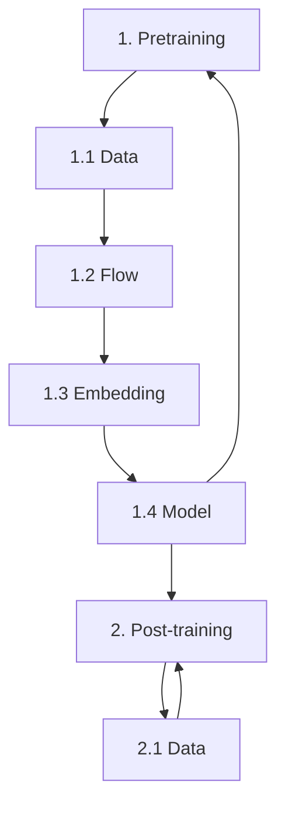
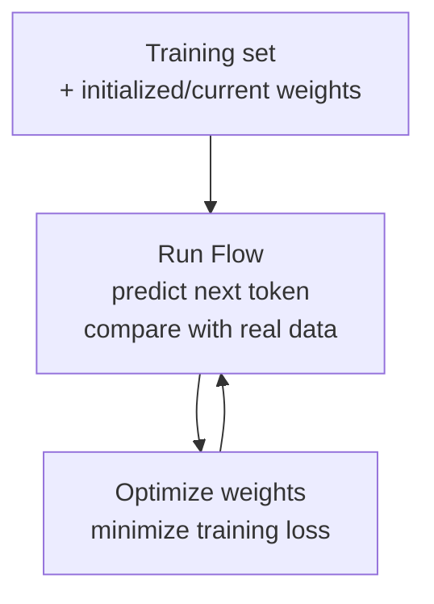
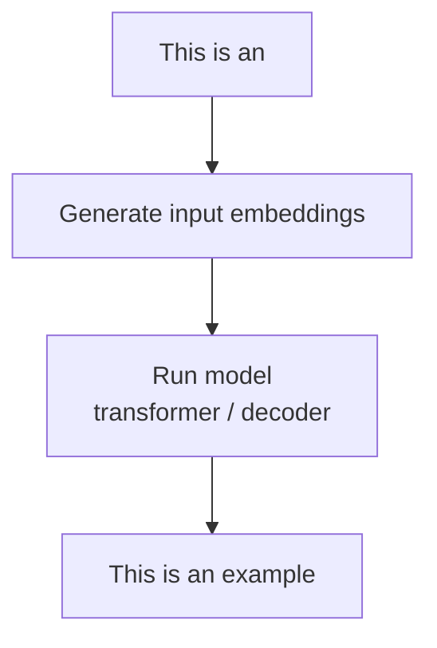
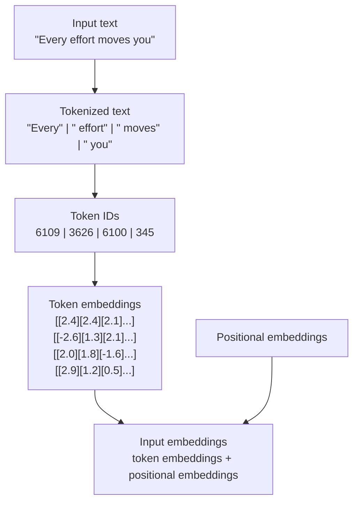
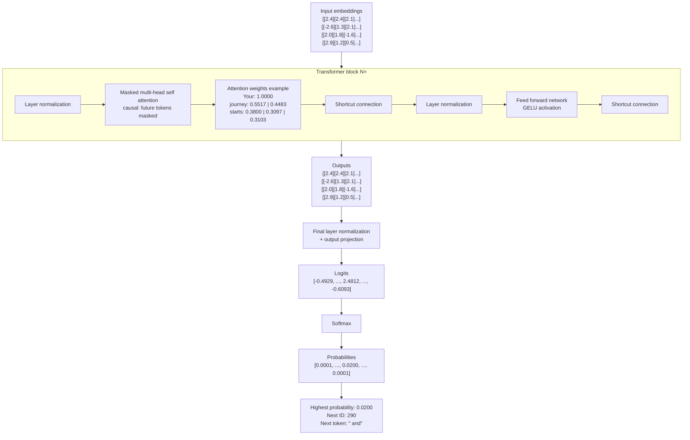
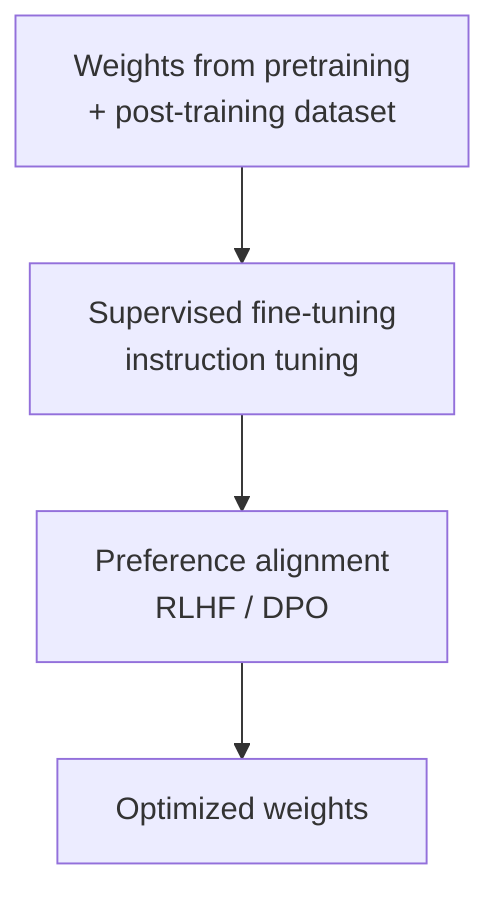

# hellollm master



<a id="pretraining"></a>

<details>
<summary>1.0 Pretraining</summary>

Source: [1.0_PRETRAINING.md](1.0_PRETRAINING.md)



</details>

<a id="pretraining-data"></a>

<details>
<summary>1.1 Data</summary>

Source: [1.1_DATA.md](1.1_DATA.md)

| Dataset      | Source                              | Size        |
| ------------ | ----------------------------------- | ----------- |
| Common Crawl | https://commoncrawl.org             | ~100.000 GB |
| WebText2     | https://openwebtext2.readthedocs.io | ~70 GB      |
| Wikipedia    | https://www.wikipedia.org           | ~100 GB     |
| The Pile     | https://arxiv.org/abs/2101.00027    | ~1.000 GB   |
| Books1/2     | unknown                             | unknown     |

</details>

<a id="flow"></a>

<details>
<summary>1.2 Flow</summary>

Source: [1.2_FLOW.md](1.2_FLOW.md)



</details>

<a id="embedding"></a>

<details>
<summary>1.3 Embedding</summary>

Source: [1.3_EMBEDDING.md](1.3_EMBEDDING.md)



</details>

<a id="model"></a>

<details>
<summary>1.4 Model</summary>

Source: [1.4_MODEL.md](1.4_MODEL.md)



</details>

<a id="post-training"></a>

<details>
<summary>2.0 Post-training</summary>

Source: [2.0_POSTTRAINING.md](2.0_POSTTRAINING.md)



</details>

<a id="post-training-data"></a>

<details>
<summary>2.1 Data</summary>

Source: [2.1_DATA.md](2.1_DATA.md)

```
#1
Q: Convert 45 kilometers to meters.
A: 45 kilometers is 45,000 meters.

#2
Q: Provide a synonym for “bright.”
A: A synonym for “bright” is “radiant.”

#3
Q: Remove passive voice in the sentence: “The song was composed by the artist.”
A: The artist composed the song.
```

</details>
