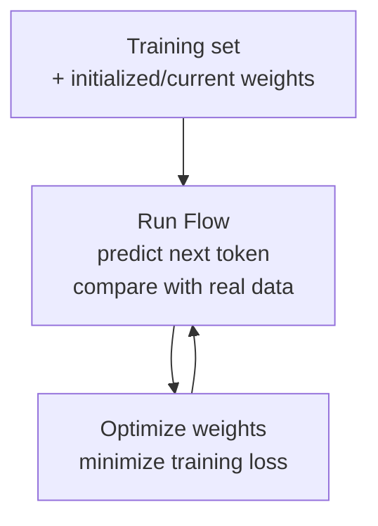

```mermaid
flowchart TD
    A["Training set<br/>+ initialized/current weights"]
    B["Run Flow<br/>predict next token<br/>compare with real data"]
    C["Optimize weights<br/>minimize training loss"]

    A --> B --> C --> B

    click A "https://github.com/vielhuber/hellollm/blob/main/src/1.1_DATA.md" "Open training data"
    click B "https://github.com/vielhuber/hellollm/blob/main/src/1.2_FLOW.md" "Open flow"
```
