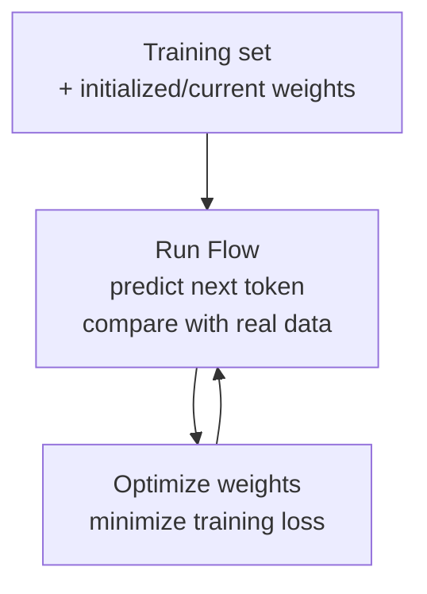

```mermaid
flowchart TD
    A["Training set<br/>+ initialized/current weights"]
    B["Run Flow<br/>predict next token<br/>compare with real data"]
    C["Optimize weights<br/>minimize training loss"]

    A --> B --> C --> B
```

Links: [1.1_DATA.md](1.1_DATA.md), [1.2_FLOW.md](1.2_FLOW.md)
