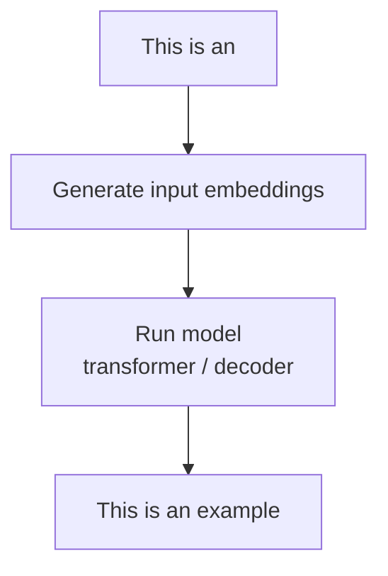

```mermaid
flowchart TD
    A["This is an"]
    B["Generate input embeddings"]
    C["Run model<br/>transformer / decoder"]
    D["This is an example"]

    A --> B --> C --> D

    click B "1.3_EMBEDDING.md" "Open embedding flow"
    click C "1.4_MODEL.md" "Open model flow"
```
