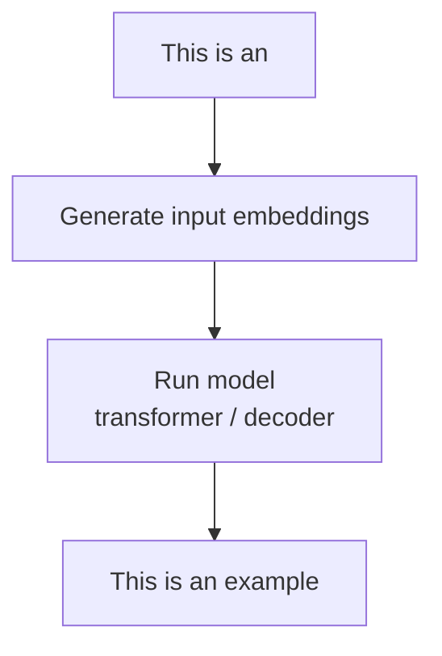

```mermaid
flowchart TD
    A["This is an"]
    B["Generate input embeddings"]
    C["Run model<br/>transformer / decoder"]
    D["This is an example"]

    A --> B --> C --> D
```

Links: [1.3_EMBEDDING.md](1.3_EMBEDDING.md), [1.4_MODEL.md](1.4_MODEL.md)
