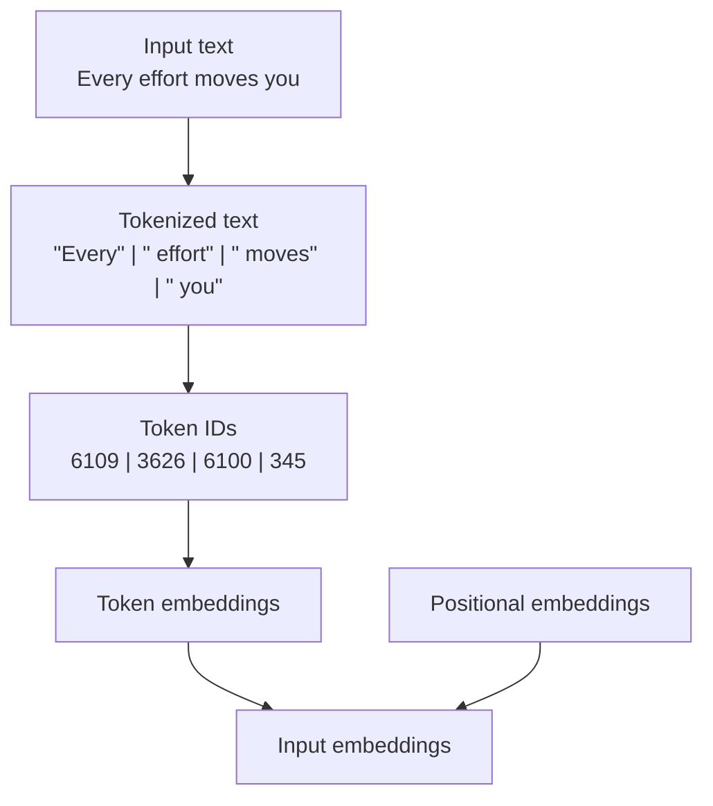

```mermaid
flowchart TD
    A["Input text<br/>Every effort moves you"]
    B["Tokenized text<br/>&quot;Every&quot; | &quot; effort&quot; | &quot; moves&quot; | &quot; you&quot;"]
    C["Token IDs<br/>6109 | 3626 | 6100 | 345"]
    D["Token embeddings"]
    E["Positional embeddings"]
    F["Input embeddings"]

    A --> B --> C --> D --> F
    E --> F
```
