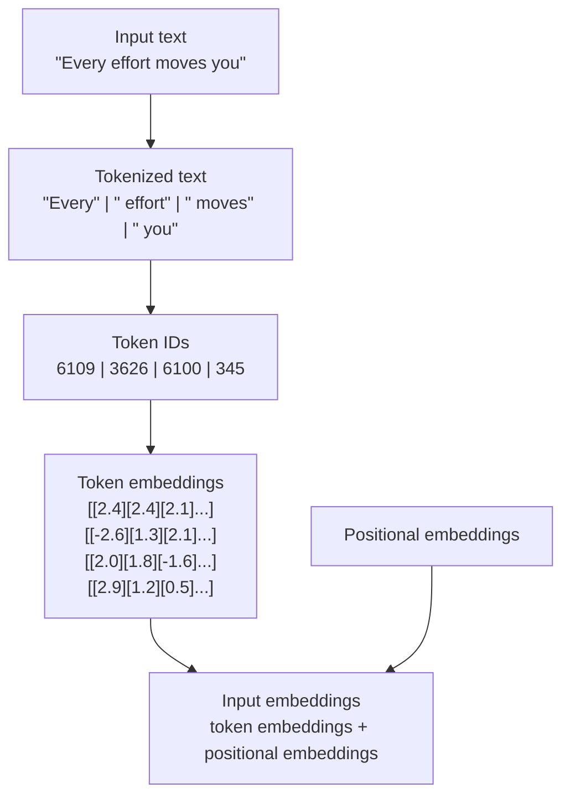

```mermaid
flowchart TD
    A["Input text<br/>&quot;Every effort moves you&quot;"]
    B["Tokenized text<br/>&quot;Every&quot; | &quot; effort&quot; | &quot; moves&quot; | &quot; you&quot;"]
    C["Token IDs<br/>6109 | 3626 | 6100 | 345"]
    D["Token embeddings<br/>[[2.4][2.4][2.1]...]<br/>[[-2.6][1.3][2.1]...]<br/>[[2.0][1.8][-1.6]...]<br/>[[2.9][1.2][0.5]...]"]
    E["Positional embeddings"]
    F["Input embeddings<br/>token embeddings + positional embeddings"]

    A --> B --> C --> D --> F
    E --> F
```
