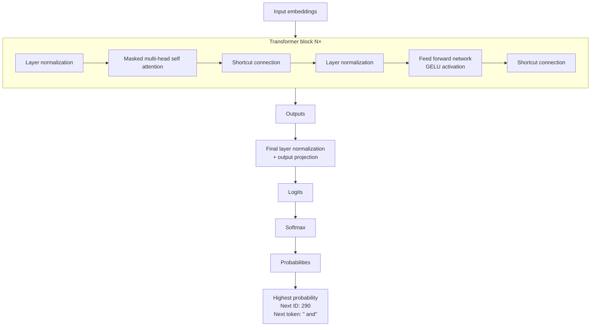

```mermaid
flowchart TD
    A["Input embeddings"]

    subgraph T["Transformer block N×"]
        B["Layer normalization"]
        C["Masked multi-head self attention"]
        D["Shortcut connection"]
        E["Layer normalization"]
        F["Feed forward network<br/>GELU activation"]
        G["Shortcut connection"]

        B --> C --> D --> E --> F --> G
    end

    H["Outputs"]
    I["Final layer normalization<br/>+ output projection"]
    J["Logits"]
    K["Softmax"]
    L["Probabilities"]
    M["Highest probability<br/>Next ID: 290<br/>Next token: &quot; and&quot;"]

    A --> T --> H --> I --> J --> K --> L --> M
```
