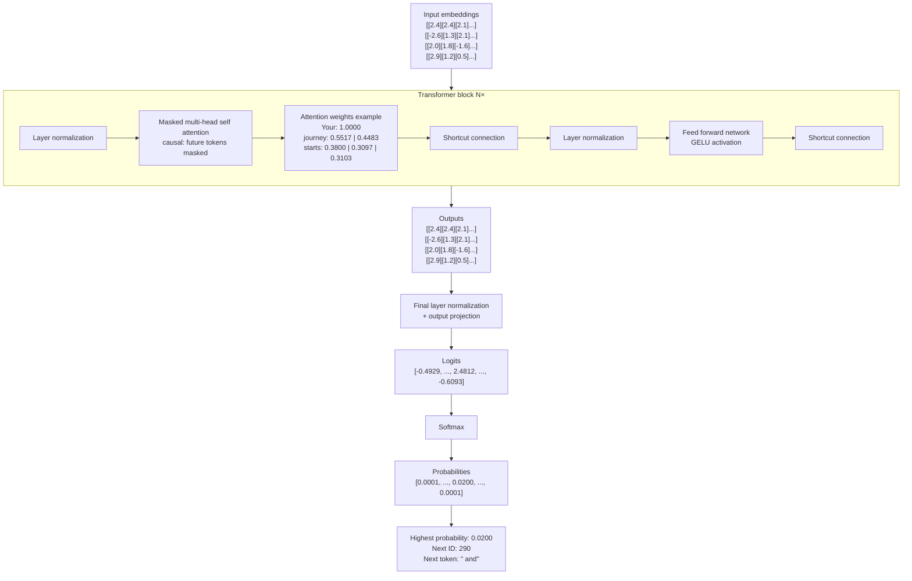

```mermaid
flowchart TD
    A["Input embeddings<br/>[[2.4][2.4][2.1]...]<br/>[[-2.6][1.3][2.1]...]<br/>[[2.0][1.8][-1.6]...]<br/>[[2.9][1.2][0.5]...]"]

    subgraph T["Transformer block N×"]
        B["Layer normalization"]
        C["Masked multi-head self attention<br/>causal: future tokens masked"]
        C2["Attention weights example<br/>Your: 1.0000<br/>journey: 0.5517 | 0.4483<br/>starts: 0.3800 | 0.3097 | 0.3103"]
        D["Shortcut connection"]
        E["Layer normalization"]
        F["Feed forward network<br/>GELU activation"]
        G["Shortcut connection"]

        B --> C --> C2 --> D --> E --> F --> G
    end

    H["Outputs<br/>[[2.4][2.4][2.1]...]<br/>[[-2.6][1.3][2.1]...]<br/>[[2.0][1.8][-1.6]...]<br/>[[2.9][1.2][0.5]...]"]
    I["Final layer normalization<br/>+ output projection"]
    J["Logits<br/>[-0.4929, ..., 2.4812, ..., -0.6093]"]
    K["Softmax"]
    L["Probabilities<br/>[0.0001, ..., 0.0200, ..., 0.0001]"]
    M["Highest probability: 0.0200<br/>Next ID: 290<br/>Next token: &quot; and&quot;"]

    A --> T --> H --> I --> J --> K --> L --> M
```
