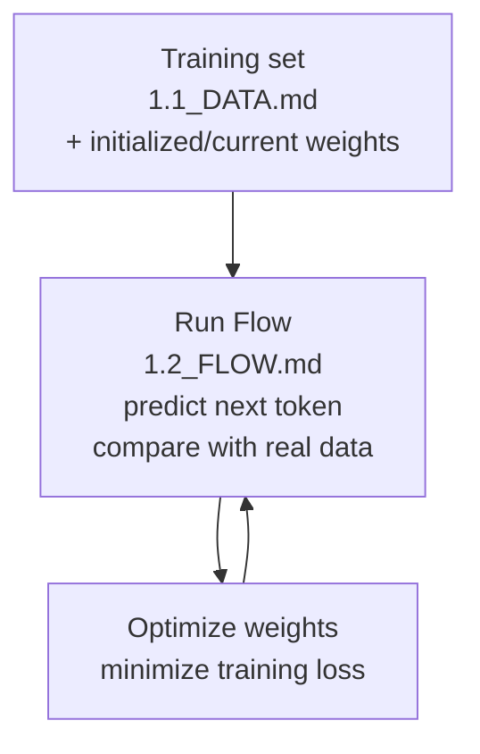

```mermaid
flowchart TD
    A["Training set<br/>1.1_DATA.md<br/>+ initialized/current weights"]
    B["Run Flow<br/>1.2_FLOW.md<br/>predict next token<br/>compare with real data"]
    C["Optimize weights<br/>minimize training loss"]

    A --> B --> C --> B
```
