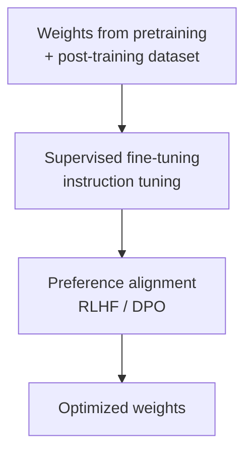

```mermaid
flowchart TD
    A["Weights from pretraining<br/>+ post-training dataset"]
    B["Supervised fine-tuning<br/>instruction tuning"]
    C["Preference alignment<br/>RLHF / DPO"]
    D["Optimized weights"]

    A --> B --> C --> D

    click A "2.1_DATA.md" "Open post-training data"
```
